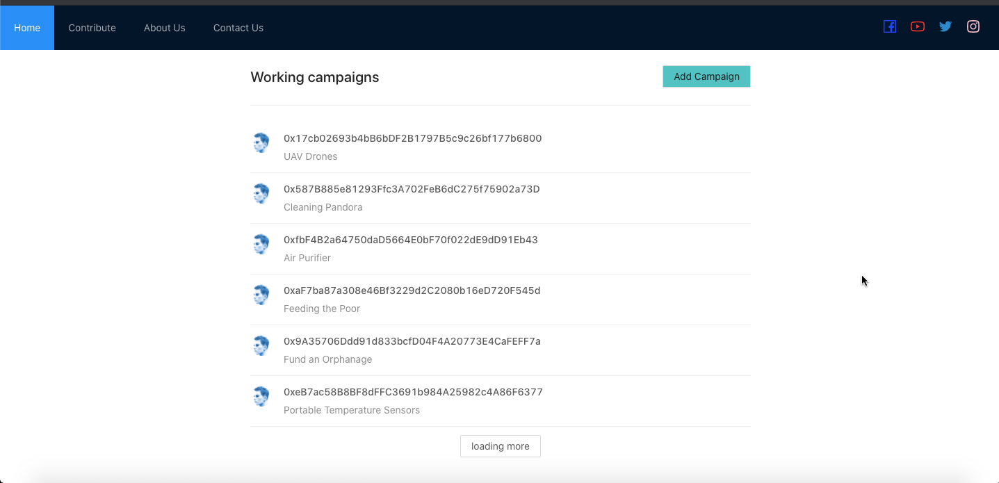
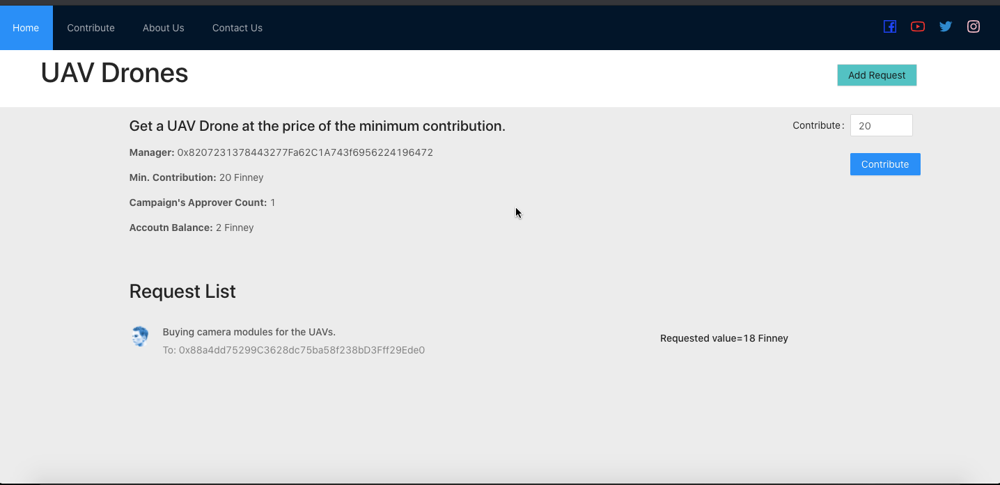
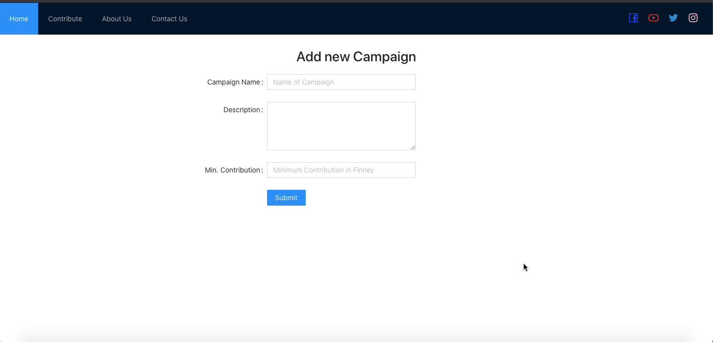

### About
An ethereum based Charity Application. The main benefits provided by the DApp are trust, transparency and consensus.

### Technologies Used

##### Back End

-   [Node](https://nodejs.org)
-   [Ethereum](https://www.ethereum.org/)
-   [Solidity](https://solidity.readthedocs.io/en/v0.5.12/)
-   [Web3](https://web3js.readthedocs.io/en/v1.2.2/)

##### Front End

-   [React](https://reactjs.org)

---

### Contributing

See [CONTRIBUTING.md](CONTRIBUTING.md).

---